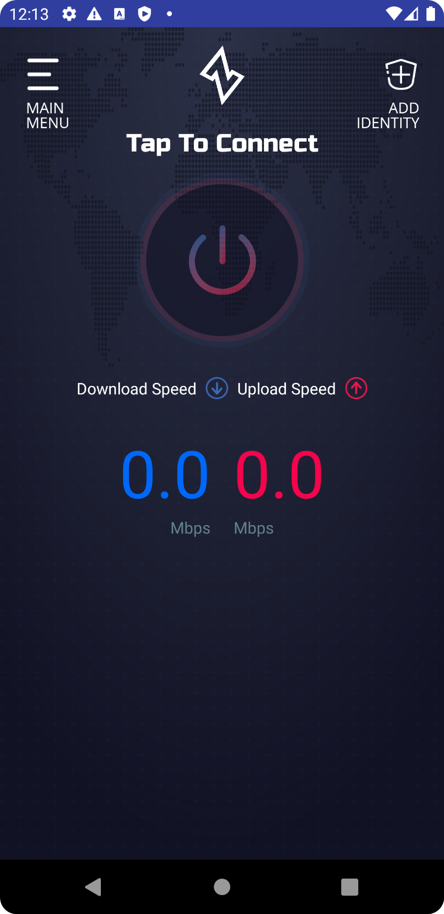

## Building ziti-tunnel-android
There being no documentation of any kind for the Android clients, I have started some starting with how to build it.
Thankfully it is pretty straightforward and there were no tricks or gotchas. I have successfully built 
the Android tunnel app on Windows 11 using Android Studio:

```
Android Studio Bumblebee | 2021.1.1 Patch 1
Build #AI-211.7628.21.2111.8139111, built on February 2, 2022
Runtime version: 11.0.11+9-b60-7590822 amd64
VM: OpenJDK 64-Bit Server VM by Oracle Corporation
Windows 10 10.0
GC: G1 Young Generation, G1 Old Generation
Memory: 1280M
Cores: 8
Registry: external.system.auto.import.disabled=true
Non-Bundled Plugins: org.jetbrains.kotlin (211-1.6.10-release-923-AS7442.40), org.intellij.plugins.markdown (211.7142.37)
```

1. Download and install the latest version of the [Android studio](https://https://developer.android.com/studio)
   Accept all the defaults and all the license terms etc. 
2. Launch Android Studio and let it do its downloads and updates - and you thought it had done that! 
3. Install git and ensure it is in the path so you can run git from the command line. 
   Verify this as the build will not work otherwise. 
   The gradle build script uses the git command line to extract version information at build time. 
   Without git the build immediately fails with an *invalid version error*.
4. In the GitHub repository create a branch give it a good name
5. In GitHub click the code dropdown code and copy the URL of the repository
5. In Android Studio checkout the branch you just created
6. Wait for the project to sync
7. Select Build | Make project. There will be some warnings but no errors.  
8. Run the app in the emulator. Wait... it might take a while to boot and load.
9. If all goes well the ziti tunnel app should run and this screen will be displayed:



## Android emulator
The Android emulator *will not run* inside a VM as it needs direct access to the virtualization.
I have tried to enable the CPU virtualization option on the VM in VMWare and while the emulator initially 
boots, it fails before loading the main screen. So run it locally like all the instructions say
you must. 

I have tested this build using the Android emulator with a virtual Pixel 3a device running Android 11.